# A Comprehensive Guide On WireGuard/DNSCrypt/SSH/Honeypot Implementation on OVH (Or any other Debian VPS) #

### Introduction ###

The plan in this guide is to create a secure WireGuard VPN which has its
own embedded DNSCrypt DNS resolver, this ensures that all connections
including DNS requests made by the user are tunnelled through the VPS
and is encrypted end to end. This is also expanded to include security
that resolves around this process making the server as secure as
possible from external agents. The following represents the proposed
network diagram for this guide.

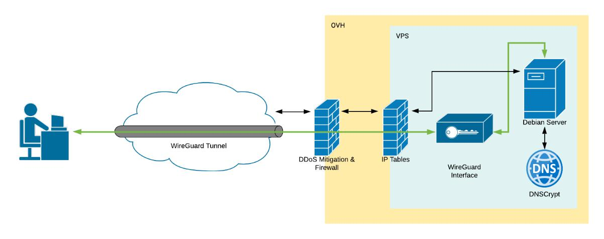

Why use WireGuard? As you can see in the image after this paragraph,
whilst on the WireGuard VPN speed decrease against a direct connection
to the internet is negligible (~3Mbps), this is because WireGuard runs
within the kernel space and thus ensures the secure tunnel can run at
high speed, it is even now part of the latest Linux Kernel 5.6. But
while this was my personal reason for implementing WireGuard there is
also the benefits in its simplicity in both development, with a lean
codebase of 4000 lines (compared to 100,000 in OpenVPN) but also in its
implementation -- which will be illustrated in this guide.
Fundamentally, you install the service and a client and exchange keys;
it can't be easier than that. WireGuard also supports better
cryptographic methodologies than OpenVPN and easier to expand and
distribute among peers.

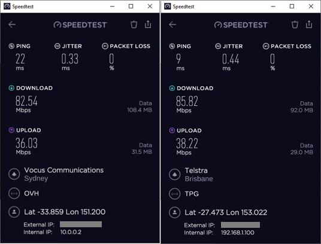

### Buying and setting up the VPS ###

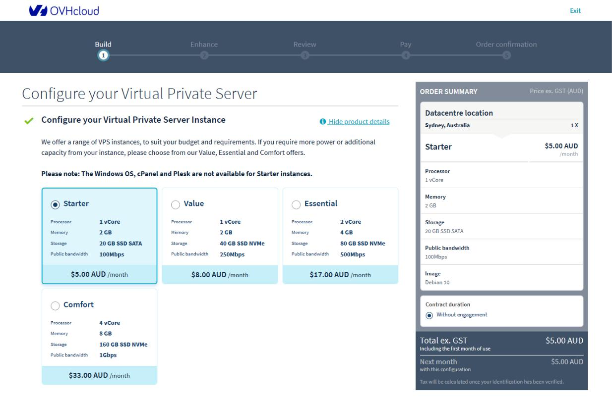

To start this project you need your own virtual private server (VPS), I
recommend OVHcloud https://ovh.com.au/ and their cheapest
starter package which is $5.00AUD a month. You get 2 GB of memory which
is more than enough to host multiple clients on the VPN. You can generally
choose what operating system you want, or upload your own ISO, but in this
example I have chosen Debian 10. Once paid for you will receive your IP address, 
username and password which you'll use to connect to the server. This can either be
via the KVM (so terminal within the browser, or VNC if they've provided it) or directly
via SSH using the details they've provided.

Be sure to issue `apt update` and `apt upgrade` and do this regularly. I also recommend changing
the password that they give you and securing your account in the method you prefer.

The first thing to do is to now secure the SSH connection and ultimately
customise it.

Start by installing fail2ban, an active intrusion detection system
designed to ban brute force attempts towards your SSH. Issue the
following commands to install fail2ban:

-   `apt install fail2ban`

-   `cp /etc/fail2ban/fail2ban.conf /etc/fail2ban/fail2ban.local`

-   `cp /etc/fail2ban/jail.conf /etc/fail2ban/jail.local`

Once this is done you'll need to modify the `/etc/fail2ban/jail.local`
file to adjust the time limits, this will mean that users whom attempt
to login to your SSH will get banned for x period of time after x
attempts etc.

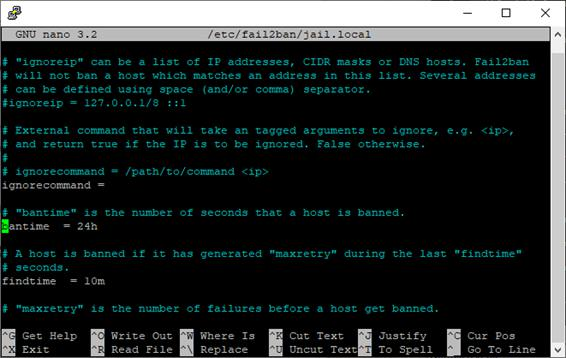

From here you can issue the command `systemctl status fail2ban.service`
to confirm the service is indeed running. You can also view the IP's
that are currently banned with the command `fail2ban-client status
sshd`, through the iptable rules or view the log file directly at
`/var/log/fail2ban.log`.

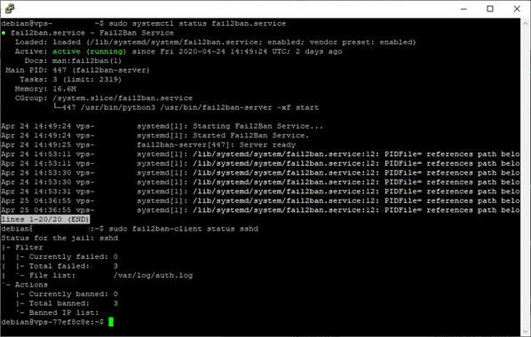

Another important step is to change the default SSH port of 22 to
something else. This will aid in preventing automated bots from scanning
your VPS, though it would not prevent somebody from discovering it
eventually. This can be done by modifying the SSH config file at
`/etc/ssh/sshd_config`. Don't forget to update your fail2ban to suit the
change (and restart it), but I have noticed that fail2ban does not seem to enjoy being
modified after the fact. If this is the case for you just modify the
iptables manually. To delete the original rule, find its number with
`iptables -L -v -n --line-numbers` and deleting it with `iptables -D
INPUT #`. Now to add your bespoke SSH port with fail2ban issue the
following command `iptables -A INPUT -p tcp --dport SSHPORT# -j
f2b-sshd`.

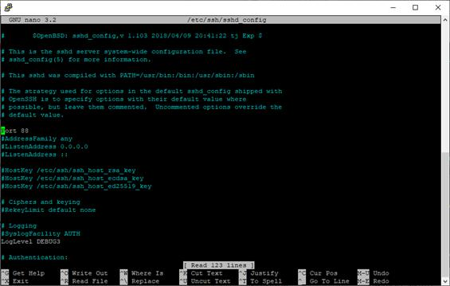

### Who Are You?? ###

Well okay, so you've setup fail2ban and the whole time you've likely been root.
Well for the next phase you have the choice to continue entirely as root, or make
a seperate account and sudo root instead. The security implications are for you to
research, but in my case I have chosen to login to the server not via root, but
with an account with no sudo access whatsoever. From there I log into root.
I feel this adds another tiny extra little itsy bitsy layer of protection should my
keys for SSH be divulged. So what did I do? Well first I changed the default root password
with `sudo passwd` then I made a new blank user with `sudo adduser debian`. Now I can
swap between the accounts by issuing the `su` command. So `su debian` or just `su` to get back
to root. Easy!

### Password-free Entry (Windows) ###

The next step is to be able to login to the VPS without a password or
even a password prompt (although this is optional), thus we would need
to use SSH key pairs. This can be generated from Windows or within Linux
directly. The first step in achieving this is to disable password
authentication within the SSH config file, so after modifying the port
scroll down modify the following two settings `PasswordAuthentication
no` and `UsePAM no`. At the bottom of the configuration file add the
following `AuthenticationMethods publickey`. If you are not going to log in
as root, it is important to change the setting here, so comment out `PermitRootLogin`. 
Save the configuration file but do not close or reset the current PuTTY session as you have not setup the keys! 
Worst case scenario you can still access your server through the KVM console within the OVH website.

Now the keys need to be generated. Continuing with an example from
Windows, launch the PuTTY Key Generator and generate the public/private
key pair without a password.

Once this is done save both the public and private keys. The public key
will be saved as `authorized_keys` and the private key will be saved with a filename of
your choosing (ending in .ppk, the PuTTY format). To ensure future
compatibility be sure to click on the conversions option and select
export what you have generated as OpenSSH key, again without a password.

Now you have to upload the public key, `authorized_keys`, to the VPS. This can be achieved
using PuTTY's SCP tool by issuing the following command from the Windows
console `pscp c:\documents\authorized_keys debian@example.com:/home/debian/.ssh`.
Or you could simply copy the public key from within the PuTTY Key Generator and paste it.
This is possible because if you're logged into the servia via PuTTY it will allow you to paste.
So make the `.ssh` diretory within your user, make an `authorized_keys` file within it and paste!

Now in order to connect from Windows using PuTTY you have to select the
private key from within the application.

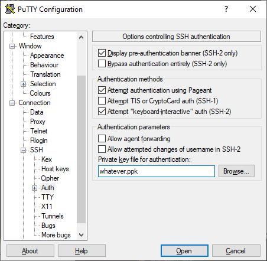

At this point you should restart the SSH service with the command
`systemctl restart sshd`. Open another PuTTY session with the
appropriate private key added and attempt to connect to the server. If
all goes well you will be prompted for a username and will be instantly
logged in. Should you not have a private key set you will be given the
following message instead.

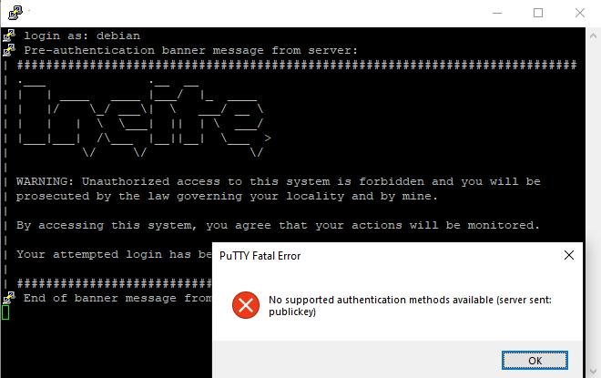

### Password-free Entry (Linux) ###

Should you want to do the key generation from Linux and login from Linux
the following steps must be done. This can be done either on the server
or on your own Linux machine. After the step of modifying the SSH
configuration you generate the key pair by running the `ssh-keygen --t
rsa` command. From here you will be prompted where to save the private
key, the default of which is acceptable but I suggest saving the file
name as `authorized_keys`. Enter no password (ultimately your choice).
It will then prompt you where to save the public key, again the default
is sufficient. You then need to ensure that the private key is stored on
your client machine and the public key is stored on the server pursuant
to the previous steps in the `/home/username/.ssh` folders -- moving the
files can be achieved through SCP much like with PuTTY. Change the
permission of the id_rsa file with `chmod id_rsa 700`. You can then
access the server with `ssh SERVERIP -p SSHPORT`.

### Port Knocking ###

Now it's time to setup port knocking. This will ensure that along with a
different SSH port number, it will remain blocked in the iptables (to be
setup next) unless a specific sequence of ports are 'knocked'. Only then
the iptables will allow the SSH port to be open to the IP address of the
knocker. So the first step is to simply install the service required
with the command `apt-get install knockd`. Now before its run its
important to modify the default settings, the service even has a
starting flag hidden away in a different file that must be changed prior
to being started for the first time. The configuration file is in
`/etc/knockd.conf` and this is my recommended bespoke settings:

What these settings achieve is the need to knock in the sequence 1337,
8888 and 1200 within 5 seconds of each other (Can be any sequence and
amount of ports you wish). When this is done the IP address of the one
who knocked will be added to the iptables, allowing exclusive access to
port 88 (or whatever port you set SSH to). It will also only accept TCP
SYN packets. After 15 seconds the IP that was added to the iptables will
be removed -- this won't log you out of the SSH session but it will
prevent you from logging back in without knocking again, this is easier
than the default settings which require the user to knock the SSH port
shut, which can be easily forgotten.

Now access the following file `/etc/default/knockd` and change
`START_KNOCKD` to `1`. Then start the knockd service by running
`systemctl start knockd`. From this point onwards you will not be able
to access the SSH normally (Well after you've finished setting up IP Tables). 
Note that according to the rules, the IP that knocked is the IP that will be 
added to the iptables -- remember to be mindful of this. 
This will be modified again after WireGuard is installed. 

Once this is set up install knockd on another Linux machine
and issue the command `knock -v IP PORT1 PORT2` to open SSH or for
Windows download the application `BwE Port Knocker` (available on my
GitHub) which I developed for this very write-up. This will be vital to
getting back into the VPS. Again, should there be a situation where you
cannot login you still can via the KVM console.

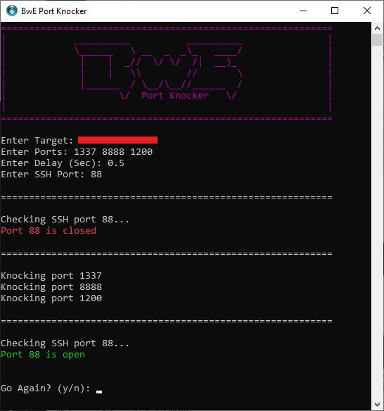

### IP Tables ###

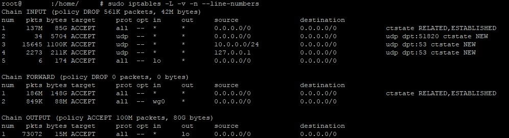

The next stage, as you can see in the above screenshot is to have
appropriate set of iptables. Creating this is an iterative process,
adding rules, testing them and eventually getting to the point where
your default policy can be DROP (even for output, if you want to be
enthusiastic). The following is a list of iptables I had created for
this project, note that port 88 (my SSH port) is not included, this is 
because the rules are now handled by the knockd service, assuming you 
have set it up properly and it is functional.

I really suggest you learn how to do iptables yourself rather than just copying
what I have below, but ultimately as long as you understand it you should be fine.
It also might be best to do this via the KVM, just in case you lock yourself out of SSH.

-  `sudo iptables -A INPUT -m conntrack --ctstate RELATED,ESTABLISHED -j ACCEPT`
-  `sudo iptables -A INPUT -s 10.0.0.0/24 -p udp -m udp --dport 53 -m conntrack --ctstate NEW -j ACCEPT`
-  `sudo iptables -A INPUT -s 127.0.0.1/32 -p udp -m udp --dport 53 -m conntrack --ctstate NEW -j ACCEPT`
-  `sudo iptables -A INPUT -i lo -j ACCEPT`
-  `sudo iptables -A INPUT -p udp -m udp --dport 51820 -m conntrack --ctstate NEW -j ACCEPT`
-  `sudo iptables -A FORWARD -m conntrack --ctstate RELATED,ESTABLISHED -j ACCEPT`
-  `sudo iptables -A FORWARD -i wg0 -j ACCEPT`
-  `sudo iptables -A OUTPUT -o lo -j ACCEPT`
-  `sudo iptables -P INPUT DROP`
-  `sudo iptables -P FORWARD DROP`
-  `sudo iptables -P OUTPUT ACCEPT`

The rules are straight forward and somewhat readable. It allows INPUT
and FORWARD connections which are related and established to continue.
It allows the UDP connection of WireGuard on port 51820. It allows what
will become WireGuard's interface ip 10.0.0.1/24 to allow DNS and also
its interface. It also allows the local host access to port 53 (DNSCrypt). 
All of these services are yet to be installed at this point, thus showing the 
iptables in one go is not really descriptive of how it will be implemented. 

Again, it must be done iteratively with each installation of each service to ensure
functionality. Once you have a functional iptables it is best to make
them persistent by running the following commands `apt-get install
iptables-persistent` and `systemctl start netfilter-persistent.service`. If
you make any changes run `sudo dpkg-reconfigure iptables-persistent`.

### Host Provided Firewall/DDoS Mitigation ###

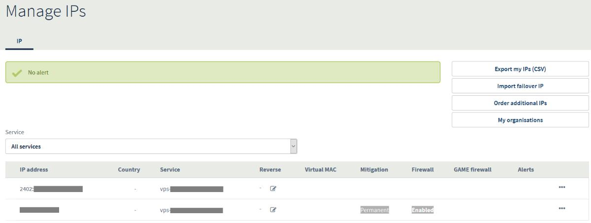

Within OVH's Manage IP's section there is the ability to change the DDoS
mitigation from Automatic to Permanent. There is also the ability to
customise their firewall. Both of these are highly recommended to add to
your service as even without advertising your server, it will likely
suffer a DDoS attack, if not multiple throughout its lifetime. As you
can see in the graph below, I had no attacks on my VPS and thus the
traffic was not very exciting, until suddenly I was hit with 80,000,000
bytes per second. I then enabled the firewall and changed the mitigation
to Permanent, and after that I had no down-time, though would still
suffer speed drops from time to time.

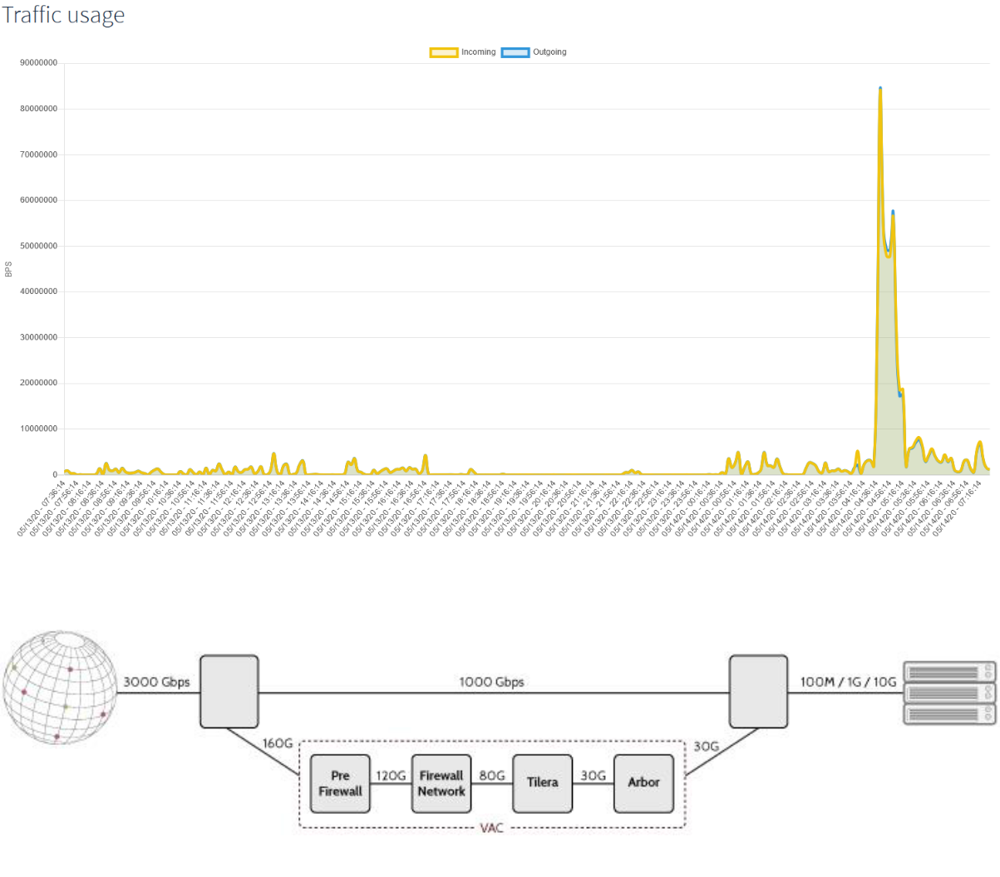

Their firewall acts as a giant filter and allows only for the traffic I
have specified to continue through, and in my case I had only enabled
WireGuard's port -- given that I will literally only be using that
single port as it will become the port for the VPN, DNS and SSH. Though
if I need to I could also enable the DNS port, but I have not needed to
thus far.

## DNSCrypt ##

Installing this on the VPS allows full ownership over DNS traffic both for your Wireguard client/s and the local network. 
Your DNS traffic will be forwarded to DNSCrypt which will in turn facilitate DNSSEC and the encryption of DNS requests. 
Now the next thing to step is to install `DNSCrypt-Proxy` itself.

You must first add the repositories required for installing either the testing or unstable version
this is done by running the following two commands.

-  `echo "deb https://deb.debian.org/debian/ testing main" | sudo tee /etc/apt/sources.list.d/testing.list`
-  `echo "deb https://deb.debian.org/debian/ unstable main" | sudo tee /etc/apt/sources.list.d/unstable.list`

You can then choose to install either one, but realistically they will likely be the same. Testing though would
be your safest bet. I personally find that the stable version is simply too old and ironically unstable.

Start with `sudo apt update && \` and then in the prompt type in `sudo apt install -t testing dnscrypt-proxy`

It is recommended then to reset and delete `/etc/apt/sources.list.d/testing.list`.

The next step then is to configure DNSCrypt, first run `nano /etc/dnscrypt-proxy/dnscrypt-proxy.toml`
and modify the `listen_address` line to be `[]`. Essentially you are removing this because it is
handled by a different service, `dnscrypt-proxy.socket`. 

Now to add your preferred DNS providers:

-  `server_names = ['doh-eastas-pi-dns', 'doh.tiarap.org', 'quad9-dnscrypt-ipv4-filter-pri', 'quad9-doh-ipv4-filter-pri', 'doh-eastau-pi-dns', 'adguard-dns-doh']`

This allows for ad blocking DNS servers to be selected and deduced based on their ping. You could also just use regular DNS servers by using the following:

-  `server_names = ['deffer-dns.au', 'publicarray-au', 'publicarray-au2', 'publicarray-au2-doh', 'publicarray-au-doh', 'cloudfare']`

Now you're wondering where am I getting these DNS names from? Well you can make your own list from https://dnscrypt.info/public-servers/.

The rest of the recommended settings:

-  `ipv4_servers = true`
-  `ipv6_servers = false`
-  `dnscrypt_servers = true`
-  `doh_servers = true`
-  `require_dnssec = true`
-  `require_nolog = true`
-  `require_nofilter = false`
-  `fallback_resolvers = ['9.9.9.9:53', '8.8.8.8:53']`

Obviously these settings are not everything, but this is what I recommend you change/add from the default.

Now download the relay and public resolvers files, because apparently DNSCrypt does not do it for you:
-  `wget https://download.dnscrypt.info/dnscrypt-resolvers/v3/relays.md -P /etc/dnscrypt-proxy/`
-  `wget https://download.dnscrypt.info/dnscrypt-resolvers/v3/public-resolvers.md -P /etc/dnscrypt-proxy/`

Now you need to the aforementioned `dnscrypt-proxy.socket` service to point to the correct IP address, so run `sudo nano /lib/systemd/system/dnscrypt-proxy.socket`
and modify `ListenStream` and `ListenDatagram` to be `0.0.0.0:53`. Having it at 0.0.0.0 rather than 127.0.0.1 means that wg0
will be able to access it. You can point your clients to use this DNS by changing their configuration to point to the DNS of 10.0.0.1.

At this stage  you need to modify your systems default resolve file, but first back it up  
with `cp /etc/resolv.conf /etc/resolv.conf.backup` then delete it and make a new one and 
insert `nameserver 127.0.0.1` and `options edns0`. You are no longer using your default DNS!

Your system will likely try and revert these settings so lock the file with 
`chattr +i /etc/resolv.conf`, note that the `-i` switch will unlock it. 
You should also modify `/etc/systemd/resolved.conf` and uncomment or add
`DNSStubListener=No` this may help prevent port clashing in the future.

Once this is all done, you should restart the service daemon with `systemctl daemon-reload`.
Now you can restart the DNSCrypt service with `systemctl restart dnscrypt-proxy`.

Check if its running with `systemctl status dnscrypt-proxy`. If it all went well it should look like this:

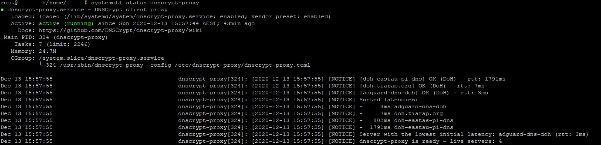

Now run `sudo dnscrypt-proxy -resolve google.com` if this succeeded you are good to go!
If it didn't you probably didn't listen to me when I said restart, so go ahead and `sudo reboot`.

Feel free to make a final confirmation test of the DNS by running
`nslookup -q=A whoami.akamai.net` and looking at the respondant IP, thats your DNS.
Once you have wireguard setup can also go to `www.dnsleaktest.com` on your client device to see which server/s you're using.

Don't have nslookup? `sudo apt install dnstools`, you will likely need this in the future anyhow.

Another test you can do for the client side is to simply stop the DNSCrypt service, if websites timeout - its working!

## WireGuard ##

Now to finally install WireGuard, this is achieved by issuing `apt-get
install wireguard`. Ensure the service is installed and running by
issuing `modprobe wireguard` and `lsmod | grep wireguard`. 

For the latter command you should see something along the lines of:
-   `wireguard             225280  0`
-   `ip6_udp_tunnel         16384  1 wireguard`
-   `udp_tunnel             16384  1 wireguard`

The next step is to generate the key pair, but first change the permission of the
`/etc/wireguard/` directory with `umask 077`. This will ensure that only
the owner is able to read or execute newly-created files. Now the actual
key generation, issue `wg genkey | tee privatekey | wg pubkey > publickey`.

From this point on you can cheat by going to https://wireguardconfig.com/ and
using a generated configuration. But is not that difficult to set it up yourself, 
start with creating the following file `/etc/wireguard/wg0.conf` and adding your 
own private key and a client's public key to the following configuration in the 
image below (It is best to do both the client and server steps at the same time). 
Then save it and modify its permissions with `chmod 600 /etc/wireguard/wg0.conf`. 

Now create the `wg0.conf`:

-   `[Interface]`
-   `PrivateKey = INSERT YOUR PRIVATE KEY HERE`
-   `Address = 10.0.0.1/24`
-   `SaveConfig = true`
-   `PostUp = iptables -A FORWARD -i wg0 -j ACCEPT; iptables -t nat -A POSTROUTING -o eth0 -j MASQUERADE; ip6tables -A FORWARD -i wg0 -j ACCEPT; ip6tables -t nat -A POSTROUTING -o eth0 -j MASQUERADE`
-   `PostDown = iptables -D FORWARD -i wg0 -j ACCEPT; iptables -t nat -D POSTROUTING -o eth0 -j MASQUERADE; ip6tables -D FORWARD -i wg0 -j ACCEPT; ip6tables -t nat -D POSTROUTING -o eth0 -j MASQUERADE`
-   `ListenPort = 51820`

-   `[Peer]`
-   `PublicKey = INSERT CLIENT PUBLIC KEY HERE`
-   `AllowedIPs = 10.0.0.2/32`

Subsequent clients are  added below each other with the same formatting, to then remove a user you issue 
`wg set wg0 peer CLIENTPUBLICKEY remove` or modify the wg0.conf manually. To load a
configuration (to add another client for example) without resetting the
service run `wg addconf wg0 <(wg-quick strip wg0)`.

Now ensure that your system can accommodate IP forwarding by editing
`/etc/sysctl.conf` and adding `net.ipv4.ip_forward=1` and `net.ipv6.conf.all.forwarding=1`. 
Once this is done run `sudo sysctl -p` to load your newly edited configuration. 
Now you can finally start WireGuard with `sudo wg-quick up wg0` and confirm its running with 
`wg show`.

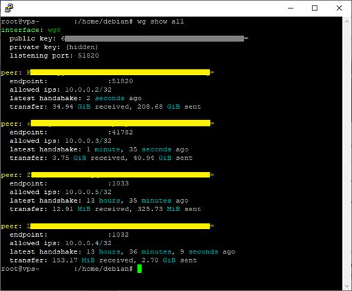

Connect to the VPS via WireGuard to finally confirm that you are indeed
part of the server's LAN, this is important for a final security measure. If all is well make
WireGuard start at boot with `systemctl enable wg-quick@wg0`. You can confirm that there is indeed
encrypting traffic by issuing `tcpdump -n -X -I eth0 host YOURSERVERIP` 
and looking for WireGuard's magic header identifier in each packet `0400 0000`.

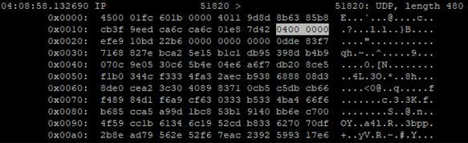

### Windows Client Side Setup ###

Running the official WireGuard client for Windows, you are able to
create a new tunnel with a few clicks. Within the client click on the
down arrow next to `Add Tunnel` and create a new tunnel. You will be
presented with a form with part of a configuration along with a
pre-generated public and private key, as seen below.

Use this information to build your client configuration as per the
second screenshot above. Once this is done, click `Activate` and you
will be connected!

### Linux Client Side Setup ###

From the client's perspective setting up WireGuard is very similar, it
starts with the following commands 'apt install wireguard resolvconf' to
install the service and to ensure the DNS functionality, then to confirm
its running run `lsmod | grep wireguard`. Now you have to generate a
private and public key, the private key stays on your system and the
public key is given to the server so you can become a peer. This is done
with `wg genkey | tee privatekey | wg pubkey > publickey`. Then
change the permission of the `/etc/wireguard/` directory with `umask
077`. Create now your own WireGuard configuration file in
`/etc/wireguard/wg0.conf` and insert the following.

The AllowedIPs setting can be changed to permit LAN access or can
restrict to a specific IP address. Once this is done change the
permissions of the file with `chmod 600 /etc/wireguard/wg0.conf` and
then ensure that your system can accommodate IP forwarding by editing
`/etc/sysctl.conf` and adding `net.ipv4.ip_forwarding=1` and
`net.ipv6.conf.all.forwarding=1`. Now you can start the connection with
`wg-quick up wg0` and confirm its running with `wg show` and finally, to
ensure it starts at boot run `systemctl enable wg-quick@wg0`.

### Adding New People Post-Installation ###

Well if you've figured it out by now new clients need a matching public and private key.
This can be generated by the server (or any linux machine running wireguard) with the command
`wg genkey | tee privatekey | wg pubkey > publickey`. If you're using the mobile app you can
do the same, just click `Create from Scratch` and in the interface section click the refresh arrows
and it will generate your private and public key. Then fill out the interface name (whatever you wish)
the IP address of the server, its port, DNS server and MTU. Then you're done. On the server side the public 
key must be added to your `wg0.conf`. So simply add another `[Peer]`, add their public key and assign their IP address.

Another way of doing this for mobile users is to generate the public and private keys for them and essentially create a configuration
and place it into a QR code for them to read. Then you add the public key youve generated into the `wg0.conf` as above.

For Windows users it is the same, but you have to write out the client configuration from scratch, you surely know how to by know!

Once this is all done you need to refresh the configuration (albeit without resetting the interface) with the command
`wg addconf wg0 <(wg-quick strip wg0)`.

## Additional Security Post Installation ##

### SSH via WireGuard (With Knocking) ###

Port knocking is great, but why allow anybody from any IP address to
knock at all? Why not limit the knocks to those already on the WireGuard
network, this way you can ensure that only those you can trust can even
begin the knocking process. This is achieved by simply modifying the
knockd configuration file, as per above, but changing the interface to wg0.
This is done by simply adding `interface = wg0` in the options section.
If you wanted to be even more paranoid, you could set up an additional
WireGuard interface specifically to access SSH and use that as the
knocking interface, this would allow sharing of the WireGuard VPN access
but also ensuring your own secure access on a different interface and IP
address, solely for SSH.

### Connection Profiling ###

To hide the fact, or at least aid in the fact you are using a VPN/Tunnel
and also to ensure that the connection between the VPS's eth0 interface
and wg0 interface do not fragment UDP packets I recommend changing the
Maximum Transmission Units (MTU). As standard, the eth0 interface will
have an MTU of `1500` and wg0 will have `1420`, which is also the default of
IPSec. Should a website attempt to fingerprint your connection it will
be possible for it to know that you are indeed on a tunnel of sorts.
Changing the wg0 interface MTU to `1500` will match the eth0, masking its
identity and also ensuring that the UDP packets do not become fragmented
given that they will both share the same maximum. This can be done by
issuing the command `sudo ifconfig wg0 mtu 1500 up` and can then be confirmed
with `netstat -i`. It can be made permanent by adding the MTU value
within the interfaces file. Remember to change this value in the config
file of your client.

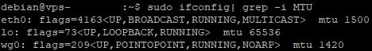

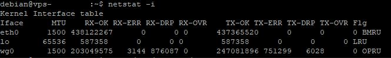

### SSH Honeypot (Optional Learning/Investigative Tool) ###

I decided to install a medium interaction SSH honeypot as this service
will likely be a target for hackers and I was curious to see the
passwords used and simply the amount of attacks I would get on a daily
basis. Now doing this will open a false SSH port, given that the real
one is on port 88 and only accessible through WireGuard this is actually
quite safe to run. There were a lot of prerequisites to install prior to
the actual honeypot and these were as follows:

-   `sudo apt-get install python-minimal`

-   `sudo apt-get install python-pip`

-   `sudo apt-get install build-essential`

-   `sudo apt-get install default-jre`

-   `sudo pip install --upgrade pip`

-   `sudo pip install setuptools`

-   `sudo pip install pyasn1 pyasn1-modules`

-   `sudo pip install virtualenv`

-   `sudo pip install pycrypto`

-   `sudo pip install virtualenv`

-   `sudo pip install twisted`

-   `sudo pip install cryptography`

-   `sudo pip install tzlocal`

-   `sudo pip install bcrypt`

Once this was done I cloned the git repository of XSweet, the SSH
Honeypot. This was done with the command `git clone https://github.com/techouss/xsweet.git`.
I did this within the home directory as I felt this would be an adequate
location, given this is also where I installed DNSCrypt. Now to run this
on port 22 I had to open it along with port 2222, the actual port that
the honeypot will be running on. I then had to forward 22 to 2222 to
ensure that the honeypot would function. This was done with the
following commands:

-   `sudo iptables -A PREROUTING -t nat -p tcp --dport 22 -j REDIRECT --to-port 2222`

-   `sudo iptables -A INPUT -p tcp --dport 2222 -j ACCEPT`

-   `sudo iptables -A INPUT -p tcp --dport 22 -j ACCEPT`

I tested its functionality by running it with `python xsweet.py` and
opening an SSH connection on port 22 to my server. It indeed functioned,
but I could not keep it running this way as it would consume the
session. I had to run it in the background and so to do this I ensured
that the `xsweet.py` file was an executable by issuing the command
`chmod +x xsweet.py`. I then made it run in the background by issuing
the command `nohup python /xsweet/xsweet.py &`, to confirm it was
running I ran `ps aux | grep xsweet` and tested the connection to the
fake SSH again.

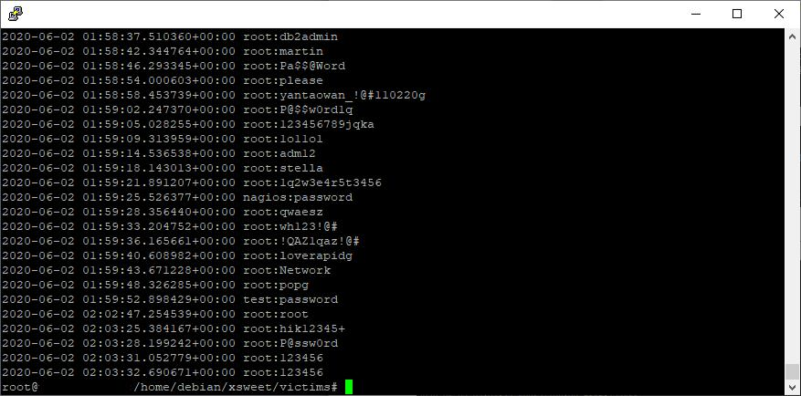

In the above screenshot you can see a list of all the failed username
and password's which were attempted against the honeypot. These are
stored within a `victims` folder along with stored sessions.

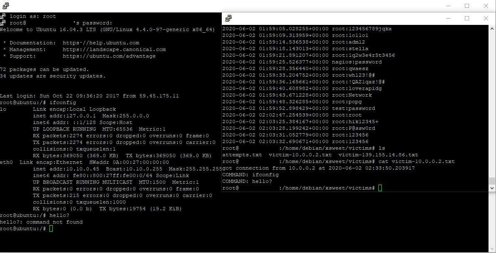

In this screenshot above you can see how the fake SSH session allows for
interaction and false outputs, of which are recorded. This would also
include files that are uploaded/downloaded to the server, this way you
can forensically examine potential malware/payloads etc.

## Other Considerations ##

You must be aware of the Autonomous System Number (ASN) that is assigned
to your server IP address when you buy your VPS. Mine for example is
AS16276, belonging to OVH SAS in Canada, its purpose is for paid VPN,
hosting and 'good' bots. It has however 40,382 active spam IP addresses
out of a total of 381,412 -- that's 10.5% of the entire network
consisting of spammers, this is not good and was likely the reason
behind having multiple DDoS attacks when my IP was still new.

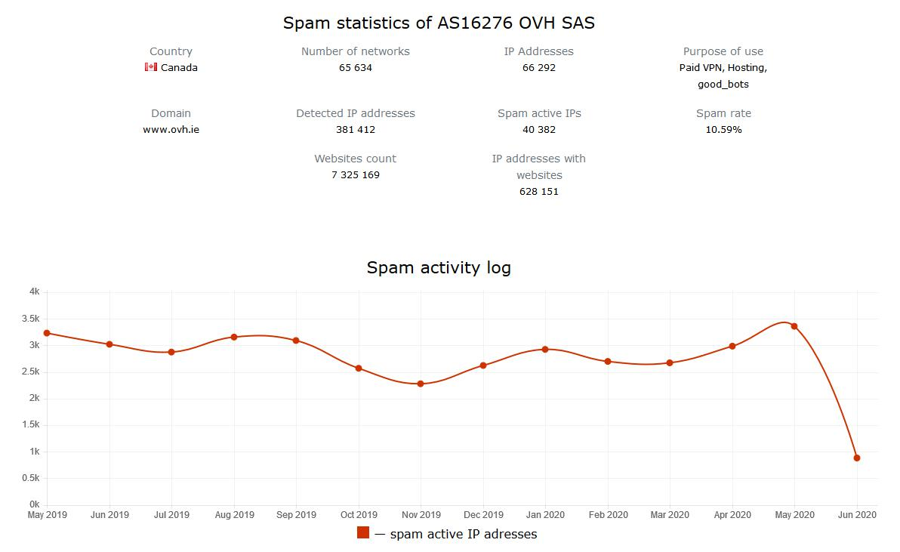

What this means is that should you indeed use your server as a VPN for
daily use, you may find that you have been banned from websites you have
never visited, this is simply because the website has chosen to ban not
your IP address but your ASN entirely. Luckily the IP address I have is
unique to my account and is not shared, this situation would be worse on
a commercial VPN provider, where allocated shared IPs can be banned in
global black lists due to spamming and other illegal activity. My ASN is
also not part of the Spamhaus Project ASN-DROP list; if it were then I
would certainly not continue using my hosting provider.

### Logs ###
I highly suggest installing `lnav` for log aggregation. But prior to doing this remember
to change your time-zone with `sudo timedatectl set-timezone your_time_zone`.

If for some reason you do not want logs I suggest running the following commands
or at least setting them up to run on a schedule in the background (see Cron Jobs):

-   `cat /dev/null > ~/.bash_history`
-   `for logs in ``find /var/log -type f``; do > $logs; done`
-   `sudo service rsyslog restart`

### Cron Jobs ###
Cron jobs are tasks that can be set automatically by the system. One that we can make that
is relevant to this project is the apparent need to make the knockd service restart itself
after the system reboots (due to wireguard starting too late) and fixing the wg0 interface MTU.

For this example start with creating a simple bash script, `nano hello.sh`.

-   `#!/bin/bash`
-   `echo "Starting Knockd and fixing MTU"`
-   `systemctl restart knockd.service`
-   `sudo ifconfig wg0 mtu 1480`
-   `echo "Done!"`

Now just save the file and change its attribute to executable with `chmod 700 hello.sh`.
To have your script run when the system starts up you have to open the crontab editor.
Do this with `crontab -e`, it will prompt you to choose an editor, go with nano, or option 1.
Within this page type in `@reboot sleep 60 && /home/wherever/your/script/is/hello.sh`.
Save and close. 

Now you have to enable the cron service with `systemctl enable cron.service`.
You can see your user cron jobs with `crontab -l` and you can see the history of your cronjobs 
with `systemctl status cron.service` or ideally `sudo grep CRON /var/log/syslog`. And thats that!

Be careful with what you put in these scripts, because they are run as root (depending on your permissions) they are very powerful.

## Tunneling aka VPN Chain aka Double-VPN ##

OK, so you're confident with this guide and you want to step it up a bit? You want to connect through two VPNs before accessing the internet?
Well first step is to literally do this guide TWICE, it's surely not that hard at this point, right?

Now you have two VPS servers we will call them VPS1 and VPS2, the first is what you will connect to, the second is what ultimately will be your external IP.
Thus it will be: `You ---> VPS1 ---> VPS2 ---> Internet`.

On VPS1, create a second wireguard interface, `wg1` and generate a new set of public and private keys with `wg genkey | tee privatekey | wg pubkey > publickey`. 
So start with `nano /etc/wireguard/wg1.conf`. Within that interface file insert the following (Note, the IP address does not have to be on a different subnet, remember, this interface is essentially another client):

-   `[Interface]`
-   `Address = 10.0.0.4/24`
-   `PrivateKey = theprivatekeyyoujustmade`
-   `FwMark = 51280`

-   `[Peer]`
-   `PublicKey = thepublickeyyoujustmade`
-   `AllowedIPS = 0.0.0.0/0`
-   `Endpoint = VPS2IPAddress:51820`
-   `PersistentKeepalive = 21`

Now edit your VPS1 `wg0` configuration file and add `FwMark = 51820` much like `wg1` has. Then add these routes using the following commands:

-   `echo "1 wg1" >> /etc/iproute2/rt_tables`
-   `ip route add 0.0.0.0/0 dev gate0 table wg1`
-   `ip rule add from 10.0.0.0/24 lookup wg1`

Now go into your VPS2 and edit its `wg0` file and add a peer using the VPS1 public key and give it the IP address of `10.0.0.4/32`.

Restart VPS2's `wg0` either fully with `wg-quick down wg0` and then `wg-quick up wg0` or just simply run `wg addconf wg0 <(wg-quick strip wg0)`.
VPS2 will now be ready to recieve VPS1, so go back into VPS1 and do the same thing to its `wg0` but also start finally you can start `wg1`.

If all went well VPS1's external IP address will now be that of VPS2. Try it out with `curl whatismyip.akamai.com`.

The client can now connect to VPS1, which will connect through VPS2! Mission Complete! You can also obviously connect to either of them individually still.
Disabling `wg1` on VPS1 will not cause any issue, the connection will just be as it was before. So you can essentially turn this ability on and off at your will.

## Troubleshooting ##

During my time with this setup I have found and discovered various small issues, 
here are my quick fixes for them.

### Unable to Locate Package: Wireguard? ###

Add these to the bottom of your `/etc/apt/sources.list`

-   `deb  http://deb.debian.org/debian  stretch main`
-   `deb-src  http://deb.debian.org/debian  stretch main`
-   `deb http://ftp.debian.org/debian buster-backports main`
-   `deb-src http://ftp.debian.org/debian buster-backports main`

Then run `apt update`.

### Wireguard Cannot Compile ###

In `/usr/src/wireguard-1.0.20200623/socket.c` add these two lines after the #include's:

-   `#undef ipv6_dst_lookup_flow`
-   `#define ipv6_dst_lookup_flow(a, b, c, d) ipv6_dst_lookup(a, b, &dst, c) + (void *)0 ?: dst`

Now as root run `/usr/lib/dkms/dkms_autoinstaller start`

If this does not work read the following and follow it `https://www.wireguard.com/compilation/`

Now remove lines 95, 96, 97 and 99 from `compat.h`
Compile and install as per the official guide

### Wireguard Won't Start ###

If you're getting an error like `RTNETLINK Operation Not Supported` when trying to start `wg-quick up wg0` 
you need to input `sudo modprobe wireguard`. If the resultant answer is something along the lines of 
`Badprobe: FATAL: Module wireguard not found in directory ...`  then your solution is to run 
`apt-get install wireguard-dkms wireguard-tools linux-headers-$(uname -r)`.

### Knockd Not Opening Port ###

Well if you've not modified the interface for knockd, it could simply be because you're on the VPN.
Its default settings are to accept knocks from eth0, if you're on the VPN you're on wg0. It won't work.
If it works when you disconnect from the VPN you should add the wg0 interface into knockd if you prefer accessing it this way.

### Knockd Not Starting at Boot ###

Confirm the issue with `systemctl is-enabled knockd.service`, if it comes up as `static`
then edit `/lib/systemd/system/knockd.service` and add this to the bottom:

-   `[Install]`
-   `WantedBy=multi-user.target`
-   `Alias=knockd.service`

Run the following: `systemctl enable knockd.service` and `systemctl is-enabled knockd.service`
it should now come up as `enabled`.

It may still not start due to the sequence of how things start up, so it may error out saying
that there is no wg0 interface. If this is the case you need to make a cron job that restarts it
after wireguard starts.

### DNSCrypt Not Starting at Boot (Or at all) ###
Confirm if port 53 is not already in use by something else with `lsof -i -P -n | grep LISTEN`
Kill the PID of whatever is already using that port.
If it is Avahi you can disable it from booting with the following commands:

-   `systemctl stop avahi-daemon.socket`
-   `systemctl stop asystemvahi-daemon.service`
-   `systemctl disable avahi-daemon`

Still not working? 
If it says `can't bind socket` or `could not open ports` try running `netstat -patuln | grep 53`.
If you see `1/init` using port 53 then you need to run `systemctl stop dnscrypt-proxy.socket`
and then restart dnscrypt again. This should fix it.

Still not working? Well I guess systemd is using port 53. You can disable it by running
`systemctl stop systemd-resolved` and `systemctl disable systemd-resolved`.
You don't really need it given you're using DNSCrypt.

### Some Websites Timeout/Cannot Resolve After Reboot ###
If you have changed the MTU it likely went back to the default and thus your client side
settings are not matching, causing dropouts.

If this is not the issue change the wg0 MTU to `1480`.
Again, ensure that your client matches the MTU settings of the wg0 interface.

